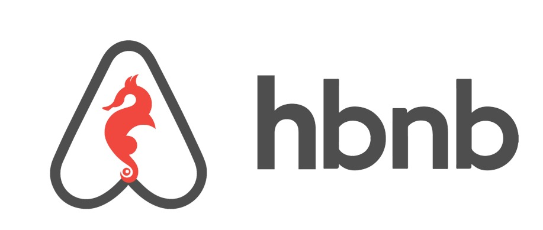

# AirBnB_clone

# Overview:
The goal of this project is to deploy a simple copy of the <a href=https://www.airbnb.com/>AirBnB</a> website as part of the <a href=https://www.alxafrica.com/>ALX</a> software engineering program. At the end of 4 months, we would have built a web application composed by:

	* A command interpreter to manipulate data without a visual interface.
	* A static and dynamic website (the front-end) that shows the final product.
	* A database and files that store data.
	* An API that provides communication interface between the front-end and our data.

# HBNB Stack:

# Phases:
## Phase one (The console):
The first piece is to build our own command line inerpreter in python, to manipulate a powerful storage engine entirely from the console to:
* create data model.
* manage (create, update, destroy, etc) objects via a console/command interpreter.
* store and persist objects to a file (JSON file).

## Other phases will be documented as development effort progresses.

# Files and Directories:
* [models](./models) directory contains all representation of the objects used for the entire project.
* [tests](./tests) directory contains all unit tests.
* [console.py](./console.py) file is the entry point of the command interpreter.
* [base_model.py](./models/base_model.py) file is the base class of all models. It contains common elements:
	* attributes: `id`, `created_at` and `updated_at`
	* methods: `save()` and `to_json()`
* [engine](./models/engine) directory contains all storage classes (using the same prototype). For now, we only have [file_storage.py](./models/engine/file_storage.py).
* [images](./images) directory contains all images used within this repository.
* [hack](./hack) contains the shell script that generated the [AUTHORS](./AUTHORS) file. If you want to use it for your project too, just wget [generate-authors.sh](./hack/generate-authors.sh) and run it from the root directory of your project like this `./generate-authors.sh`

AUTHORS: 
[Yusuf Olamilekan Muktar](www.github.com/yusufom) 
