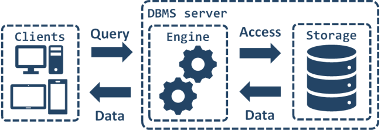

# HBNB Storage engine:

**This storage engine gives us an abstraction between data Objects and how they are stored and persisted.**
  This means we won't need to pay attention to how data objects are stored from the console code and the front-end and RestAPI we will build later. This abstraction will also   allow us to change the type of storage easily without updating the entire codebase. The console is a tool to validate this storage engine.

In this project, we will manipulate 2 types of data storage: [file](./object.json) and database. The storage management has been separated from model to make our models modular and independent. 

# With this architecture, we can easily replace our storage system without re-codng everything everywhere.
